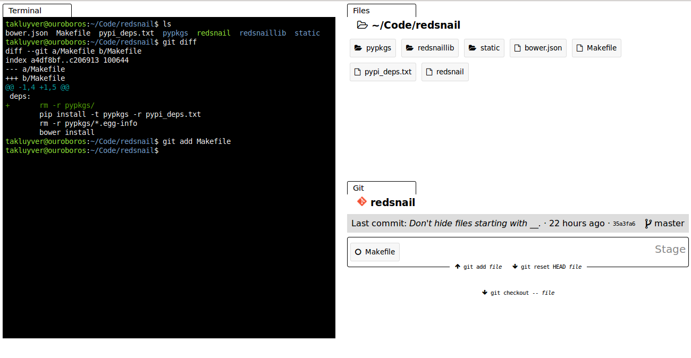

Use the power of the command line, but see what you're doing.

Are you always typing `ls` or `git status` in your shell? Have you customised
your prompt to give you extra information? Everything people do, we look at
what we're working on. Manipulating files and folders in the shell shouldn't
be any different - it should be easy to see what you're doing.

That's what Redsnail does. With every command you run, the files panel shows
you the contents of the folder you're in. ``cd`` into a git repository, and
the git panel appears.

What other panels do you want to see?

## Installation

Installable packages coming soon.

## Running from development

1. Make sure you have the development requirements: make, pip, bower.
2. Run `make deps` to fetch Python & JS dependencies
3. Run `./redsnail` to launch Redsnail.
